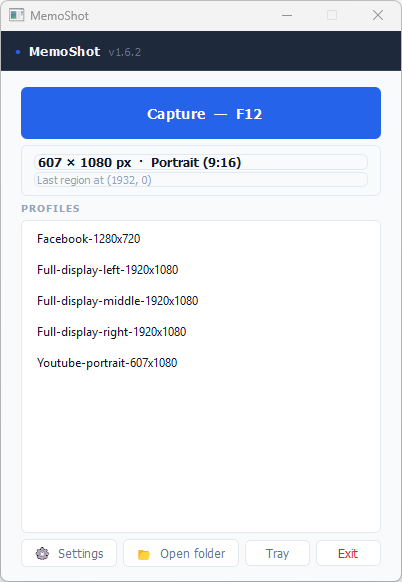
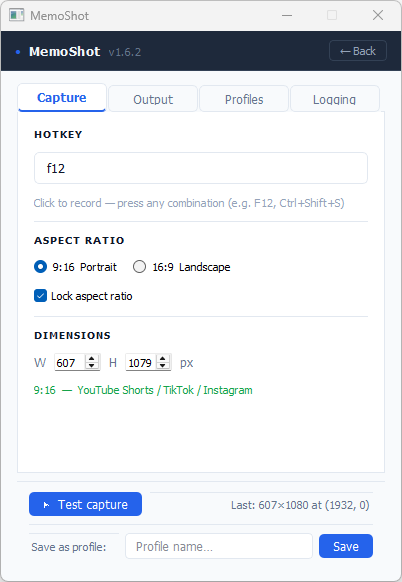
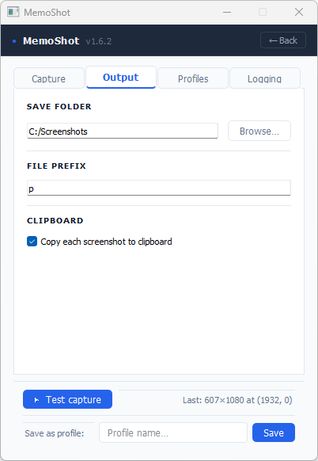
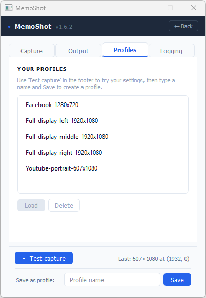
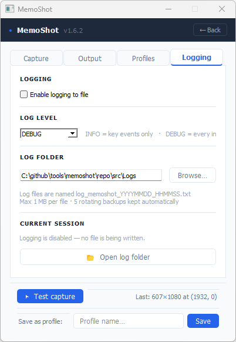

# MemoShot

A lightweight, always-available screenshot tool for content creators. MemoShot lives in the system tray, responds to a global hotkey, and saves properly sized captures for TikTok, YouTube Shorts, Instagram, LinkedIn, and any other platform — without interrupting your workflow.

## Screenshots

<div style="display: flex; gap: 10px;">
  
  
  
  
  
</div>

---

## Features

- **Global hotkey capture** — trigger from any app without switching windows. Default is `Ctrl+Shift+P`; change it by clicking the hotkey field and pressing your preferred keys directly on the keyboard.
- **Full-screen interactive overlay** — drag and resize a selection rectangle across any monitor. All edges and corners are resizable. Multi-monitor layouts with different y-origins are handled correctly.
- **Portrait & landscape modes** — 9:16 and 16:9 aspect-ratio lock. Unlock the ratio for any custom pixel size.
- **Per-mode region memory** — the overlay remembers the last capture position separately for portrait and landscape, so repeat captures are one keypress.
- **Named profiles** — save a complete snapshot of all settings (hotkey, save folder, prefix, dimensions, ratio, clipboard) under a name. Switch between profiles instantly from the main window.
- **Test capture from Settings** — run a live capture while reviewing settings, then come straight back to Settings to verify the result and save it as a profile without navigating away.
- **Auto-save settings** — every change persists immediately with no Save button.
- **Sequential or timestamp file naming** — set a file prefix for `myshot1.png, myshot2.png, …`, or leave it blank for `Portrait_YYYY-MM-DD_HH-MM-SS.png`.
- **Clipboard copy** — each screenshot is copied to the system clipboard automatically (optional).
- **Toast notification** — appears at the bottom of your primary screen after every capture. Includes a **Show in Explorer** link.
- **Keyboard shortcut overlay** — press `?` on the capture overlay to show a floating cheat-sheet of every key and mouse action.
- **Multi-monitor aware** — the overlay spans all connected screens with correct coordinate handling for non-uniform monitor arrangements. Press `S` to snap the selection to the current screen.
- **Logging** — configurable file logging with rotating log files, DEBUG/INFO level, and a dedicated Logging tab in Settings.
- **Open folder shortcut** — one-click button on the main window to open the screenshots save folder.
- **System tray** — minimises out of your taskbar. Right-click for Capture / Show Window / Exit.

---

## Requirements

- Python **3.9 or newer**
- PyQt5
- keyboard

```
pip install PyQt5 keyboard
```

> **Windows note:** the `keyboard` library requires administrator privileges (or running as a standard user on a system where UAC is not restricting hook registration) to register global hotkeys.

---

## Installation

```bash
git clone https://github.com/your-username/memoshot.git
cd memoshot
pip install PyQt5 keyboard
python src/main.py
```

No build step or installer needed. MemoShot runs directly from the source tree.

---

## Quick start

1. Run `python src/main.py`. The main window opens and the app registers in the system tray.
2. Press the hotkey (default `Ctrl+Shift+P`) from any application.
3. The overlay appears. Drag the selection rectangle to your region of interest.
4. Press `Enter` to capture. A toast confirms the save location with a **Show in Explorer** link.
5. The window stays minimised to tray until you need it again.

---

## Main window

The window has two panels that switch without opening a new window.

### Quick Capture panel (default)

| Element | Purpose |
|---|---|
| **Capture button** | Starts a capture. Shows the active hotkey as a reminder. |
| **Status card** | Shows the dimensions and position of the last captured region. |
| **Profile list** | All saved profiles. Click a row to load it — the row stays highlighted so you can always see which profile is active. |
| **⚙ Settings** | Opens the Settings panel. |
| **📂 Open folder** | Opens the screenshots save folder in the file manager. |
| **Tray** | Minimises to the system tray. |
| **Exit** | Quits the application. |

### Settings panel

Opens from the **⚙ Settings** button. **← Back** returns to Quick Capture.

Four tabs:

| Tab | Contents |
|---|---|
| **Capture** | Hotkey recorder, aspect ratio (9:16 / 16:9), ratio lock, width & height in pixels. |
| **Output** | Save folder (with Browse), file prefix, clipboard copy toggle. |
| **Profiles** | List of saved profiles. Select a row to activate Load and Delete. |
| **Logging** | Enable/disable logging, log level (INFO / DEBUG), log folder, current log file path, Open log folder button. |

**Footer (always visible across all tabs):**

| Element | Purpose |
|---|---|
| **▶ Test capture** | Runs a live capture with the current settings. Settings re-opens automatically so you can review the result before saving as a profile. |
| **Save as profile** | Type a profile name and press Save (or Enter) to snapshot all current settings. |

---

## Capture overlay controls

| Key / Action | Effect |
|---|---|
| `Enter` | Capture and save the selected region |
| `Esc` | Close the shortcut panel if open, otherwise cancel the overlay |
| `S` | Snap the selection to fill the current screen |
| `?` | Toggle the keyboard shortcut cheat-sheet |
| Drag inside the rectangle | Move the capture region |
| Drag any edge | Resize from that edge |
| Drag any corner | Resize from that corner |

---

## Hotkey recording

Click the hotkey field in **Settings → Capture**. The field turns blue and shows "Press keys…". Press your combination — for example `F12`, `Ctrl+Shift+S`, or `Alt+F4`. The field fills immediately and recording stops. Press `Escape` to cancel and keep the previous hotkey.

Supported keys: all function keys (`F1`–`F15`), navigation keys (Home, End, Page Up/Down, arrow keys), Delete, Insert, Tab, Enter, Backspace, Space, Print Screen, Scroll Lock, Pause, Num Lock, Caps Lock, and any printable character.

---

## Profile workflow

The recommended workflow for setting up a new profile:

1. Open **⚙ Settings**.
2. Configure your hotkey, ratio, dimensions, save folder, and prefix across the Capture and Output tabs.
3. Click **▶ Test capture** in the footer. The overlay opens — select your region and press `Enter`.
4. The Settings panel re-opens. The footer status line shows the captured dimensions and position.
5. If the result looks right, type a profile name in the footer field and press **Save**.
6. The new profile appears immediately in both the Quick panel list and the Profiles tab.

To switch profiles, click any row in the Quick panel list. The row stays highlighted to show which profile is active.

---

## Logging

MemoShot can write a rotating log file for every session. Configure it in **Settings → Logging**.

| Setting | Description |
|---|---|
| Enable logging | Master on/off switch. Changes take effect immediately without restarting. |
| Log level | **INFO** — key events (captures, profile loads, hotkey registration). **DEBUG** — every interaction including drag start/end, resize, snap, clipboard, file naming. |
| Log folder | Directory for log files. Defaults to `src/Logs/` relative to the script. Leave blank to keep the default. |

Log files are named `log_memoshot_YYYYMMDD_HHMMSS.txt`. Each file is capped at 1 MB with 5 rotating backups kept automatically. Click **📂 Open log folder** to browse them.

---

## Settings reference

All settings save automatically on every change. There is no Save button.

| Setting | Description |
|---|---|
| Hotkey | Global keyboard shortcut — click to record |
| Save folder | Output directory for PNG files |
| File prefix | Empty = timestamp filename. Set a prefix for numbered sequences (`prefix1.png`, `prefix2.png`, …). |
| Width / Height | Capture rectangle dimensions in pixels |
| Aspect ratio | 9:16 Portrait or 16:9 Landscape |
| Lock aspect ratio | Keeps the ratio fixed when resizing spin-boxes |
| Copy to clipboard | Copies each screenshot to the system clipboard after saving |
| Enable logging | Write a log file for this session |
| Log level | INFO or DEBUG |
| Log folder | Directory for log files (default: `src/Logs/`) |

Settings are stored as JSON at `~/.memoshot_settings.json`. You can edit this file manually while MemoShot is not running.

---

## Project structure

```
src/
├── main.py                 Entry point
├── app.py                  QApplication setup, logging initialisation
├── version.py              Version string (single source of truth)
├── core/
│   ├── settings.py         Load / save / profile helpers — no Qt dependency
│   └── hotkey.py           QThread wrapper around the keyboard library
├── capture/
│   └── screenshot.py       File naming, cropping, clipboard copy
├── ui/
│   ├── main_window.py      Two-panel main window, tray, HotkeyCapture widget
│   └── overlay.py          Full-screen capture overlay
└── utils/
    └── logger.py           Rotating file logger, apply_log_settings()
```

---

## License

MIT — do whatever you like, just keep the copyright notice.
